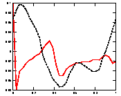

# jvpttsa
An ultrasound jugular venous pulse tracing  task specific algorithm  communicating with a central dataset repository
## Description
**jvpttsa** (Jugular venous pulse tracing task specific algorithm) aims to eliminate technical obstacles to the acquisition of the jugualar venous pulse trace.
## Features
- works with every ultrasound machine
- plot graph in real time
- store data on central repositories
## Requirements
- [DCMTK] (https://github.com/DCMTK/dcmtk)
-- sudo apt-get install dcmtk
- [ImageJ] (https://github.com/imagej/imagej)
## Credits
DICOM support from [deanvaughan.org](http://deanvaughan.org/wordpress/dicom-php-class/)
Login system from [phpcodify](http://www.phpcodify.com/angularjs-login-script-using-php-mysql-bootstrap/)

-------------------

